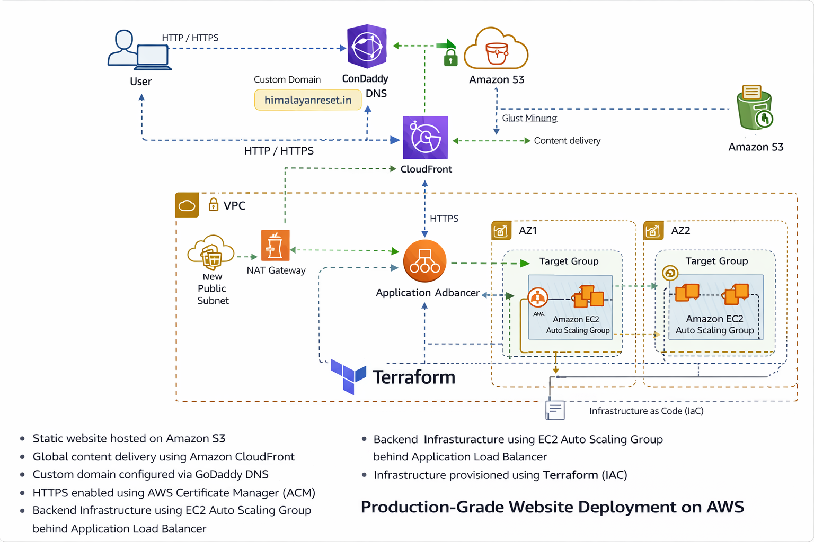

# 🌐 Production-Grade Website on AWS (S3 + CloudFront + ALB + ASG)

Live website hosted on AWS using a scalable, secure, and highly available architecture.

🔗 **Live URL:** https://himalayanreset.in

---

## 🏗️ Architecture Overview

- Static website hosted on **Amazon S3**
- Global content delivery using **Amazon CloudFront**
- Custom domain configured via **GoDaddy DNS**
- HTTPS enabled using **AWS Certificate Manager (ACM)**
- Backend infrastructure using **EC2 Auto Scaling Group** behind **Application Load Balancer**
- Infrastructure provisioned using **Terraform (IaC)**



---

## 🚀 Key Features

- **Secure HTTPS delivery** using ACM certificates
- **CloudFront cache invalidation** for instant content updates
- **S3 versioning** enabled for rollback safety
- **Auto Scaling Group** for traffic-based scaling
- **ALB health checks** for high availability
- **Terraform-managed infrastructure** for repeatable deployments

---

## 🛠️ Tech Stack

- AWS S3
- AWS CloudFront
- AWS ACM
- AWS EC2
- Application Load Balancer (ALB)
- Auto Scaling Group (ASG)
- Terraform
- GoDaddy DNS
- GitHub

---

## 📌 Terraform Snippet (ALB Example)

```hcl
resource "aws_lb" "web_alb" {
  name               = "free-tier-alb"
  internal           = false
  load_balancer_type = "application"
  security_groups    = [aws_security_group.web_sg.id]
  subnets            = [aws_subnet.public.id]
}
# production-website
